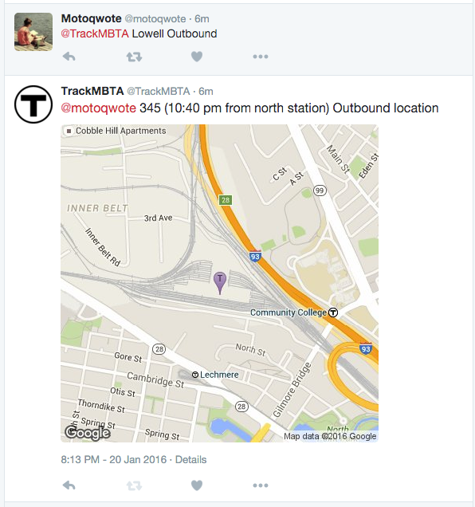

# TrackMBTA 

Get the location of your next MBTA train. Follow (@TrackMBTA)



## Usage
The bot understands commands in this format:

`@TrackMBTA LINE DIRECTION`

- `LINE` - Any MBTA train line. (Currently only supports commuter rail trains)
- `DIRECTION` - Inbound or Outbound. (Can use either 'in' or 'inbound')

### Examples
- Middleborough/Lakeville Line (inbound) - `@TrackMBTA Middleborough Inbound` or `@TrackMBTA Lakeville Inbound`
- Kingston Line (inbound) - `@TrackMBTA kingston inbound`
- Fitchburg Line (outbound) - `@TrackMBTA Fitchburg out`

### Where is the bot running?

The bot is running on [Amazon Web Services (AWS)](https://aws.amazon.com/). The bot is not resource intensive and runs pretty much free for the first year as a micro instance.

# Running

### Requirements
- Python 2+
- pip

`$  pip install -r requirements.txt`

###Instructions

Create a file called config.py that looks like config_example.py. Fill in the necessary values.

For Twitter config:

1. Register your app
2. Get your secret tokens
3. Set your environment variables accordingly.

```
TWITTER_KEY
TWITTER_SECRET
TWITTER_ACCESS_TOKEN
TWITTER_ACCESS_STOKEN
```
